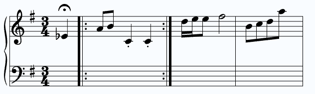

<div align="center" style="background-color: white;">
  
</div>

## Vector Score

[](https://bundlephobia.com/package/vector-score)

[](https://github.com/DrakeB1234/VectorScore)

A lightweight, SVG-based TypeScript library for rendering simple musical notation, rhythms, and guitar chords. This project aims to provide a simple to use renderer for web-based musical apps.



## Table of Contents

* [Features](#features)
* [Install](#install)
* [Core Classes](#standard-staff)
  * [Standard Staff](#standard-staff)
  * [Guitar Chord](#guitar-chord)
* [String Syntax](#string-syntax)
  * [General Syntax](#general-values-durations-articulations-)
  * [Note Syntax](#note-string-syntax)
  * [Chord Syntax](#chord-string-syntax)
  * [Rest Syntax](#rest-string-syntax)
  * [Beam Syntax](#beam-string-syntax)
* [Migration from 1.3.1 to 2.0](#migrating-from-131)
* [Resources](#resources)

## Features

**Rendering Standard Musical Notation**
* Supports grand, treble, bass, and alto clefs.
* Easy to add notes and provides justifying alignment functions.
* Notes can be drawn with accidentals, dotted durations, and articultations.
* Beamed notes are supported, with option for notes or chords.

**Render and Display Guitar Chords**
* Write explicitly which string, fret, and optionally finger to display on the diagram.
* Supports barre chords.
* Label each string below diagram, useful for showing tuning of chord.

**Extra Classes**
* Dedicated staff for rhythm exercises with customizable time signatures and bar handling.
* Staff made to allow for 'endless' style of notes.

## Install

```bash
npm install vector-score
```

## Standard Staff

### Initializing Staff
Example of initializing a StandardStaff class and applying options. Options object can be skipped and default values will be used for staff.

```ts
import { StandardStaff } from "vector-score";

const containerRoot = document.getElementById("root") as HTMLElement;

const staff = new StandardStaff(containerRoot, {
  // default: 300
  width: 400,
  // default: 1
  scale: 1.2,
  // default: 16
  noteStartX: 40,
  // default: 20
  paddingTop: 40,
  // default: 20
  paddingBottom: 40,
  // default: grand
  staffType: "treble",
  // default: true
  svgAutoFill: true,
  // optional
  keySignature: "D",
  // optional
  timeSignature: {
    topNumber: 4,
    bottomNumber: 4
  }
});
```

### Drawing elements
StandardStaff has multiple types of elements to draw, such as ***notes, chords, rests, beams, and barlines***.

Read more about [string syntax](#string-syntax)

Drawing elements using **string syntax**
```ts
...

staff.drawNote("C4q");

// Every draw method has optional options object for which staff to draw to and a list of classes to apply to that element
staff.drawNote("A3h.(staccato)", { staff: "bottom", classes: ["wrong-note"]});

staff.drawChord("[C4,E4,G4]q");

staff.drawRest("Rw");

staff.drawBeam("C4e-[D4,F4]e-G4e");

staff.drawBarline("|:");
```

Drawing batch of elements using **string sytnax**; Each element in string is separated by a space. Options are not required, but if applie will apply to *all* elements in string.
```ts
...
staff.drawBatchElements("C4w | [C4,E4,G4]q(marcato) Rh B4q(accent) | C4e-[D4,F4]e-G4e-C4e |]", { staff: "bottom", classes: ["my-notes"] })
```

Drawing elements using **config functions** (more granular control over element parameters).
```ts
import { ..., noteConfig } from "vector-score";
...

// Not every property is required
staff.drawNote(noteConfig({
  letter: "C",
  octave: 4,
  duration: "s"
  // Optional
  accidental: "#",
  // Optional
  isDotted: true,
  // Optional
  articulation: "tenuto"
}));

// Most basic note config
const note = noteConfig({ letter: "C", octave: 4, duration: "q"});

// Chord notes *DONT* contain duration per note, instead duration is defined top level of chord object.
staff.drawChord(chordConfig({
  notes: [
    {
      letter: "D",
      octave: 4,
    },
    {
      letter: "F",
      octave: 4,
    },
  ],
  duration: "q",
  articulation: "staccato",
  }),
);

staff.drawRest(restConfig({
  duration: "q",
  // Optional
  isDotted: false
}));

staff.drawBarline(barlineConfig("repeat-end"));

staff.drawBeam(beamConfig(
  noteConfig(...),
  chordConfig(...),
  noteConfig(...)
));
```

Drawing batch of elements using **config functions**. Using configs instead of strings gives options to each individual element in list.
```ts

//  Refer to section above for the actual options available in config functions.
//  Options here are applied per desired element, options are NOT REQUIRED.
staff.drawBatchElements([
  { config: noteConfig(...), options: { staff: "top", classes: ["my-note"]} },
  { config: chordConfig(...), options: ... },
  { config: restConfig(...) },
  { config: beamConfig(...) },
  { config: barlineConfig(...), options: ... },
]);

// With options being passed as the second parameter instead of per config entry, its values will be applied to each element drawn.
staff.drawBatchElements([...], options: { staff: "top", classes: ["my-note"]});
```

## Guitar Chord

### Initializing Class
Example of initializing a GuitarChord class and applying options. Options object can be skipped and default values will be used instead.

```ts
import { GuitarChord } from "vector-score";

const containerRoot = document.getElementById("root") as HTMLElement;

const guitarDiagram = new GuitarChord(containerRoot, {
  // default: 1
  scale: 1,
  // default: 6
  stringCount: 4,
  // default: 5
  fretCount: 5,
  // optional
  stringLabels: ["E", "A", "D", "G", "B", "E"],
  // default: 2
  inlineChordsAmount: 3,
  // default: true
  centerChords: false,
  // default: true
  svgAutoFill: true,

  // Best to leave undefined in options object, inlineChordsAmount handles width automatically
  // width: undefined;
});
```

### Drawing Chords

Drawing a D major chord
```ts
...

// Options for frets are x: muted, 0: open, 1-z: absolute fret number (alpha-numeric)
// Alpha numeric is used for fret numbers past '9', for example '10' == 'a' AND '11' == 'b';
const frets = "xx0232";
const fingers = "000132";

guitarDiagram.addChord(frets, fingers, {
  label: "D Major"
});
```

Drawing a F major chord (with a barre on first fret)
```ts
import {..., determineBarreOptions } from "vector-score";
...

const frets = "133211";
const fingers = "134211";

// Used to automatically determine the options for a barre (which F major has a barre on 1st fret)
// The last parameter of the helper is an array of frets where each barre (multiple values mean multiple barres) should lay.
const barreDef = determineBarreOptions(frets, fingers, [1]);

guitarDiagram.addChord(frets, fingers, {
  label: "F Major",
  barres: barreDef
});
```

Drawing a Cm7 chord (barres and example of alpha numeric fret numbers)
```ts
import {..., determineBarreOptions } from "vector-score";
...

// The 'a' value in fret refers to the number '10', which is the value of 'a' in alpha-numeric value.
const frets = "8a8888";
const fingers = "131111";

// Barre on the 8th fret
const barreDef = determineBarreOptions(frets, fingers, [8]);

guitarDiagram.addChord(frets, fingers, {
  label: "Cm7",
  barres: barreDef
});
```

## String Syntax

### General Values (durations, articulations, ...)
Duration string values
* `w | h | q | e | s | t` - These are shorthands used in string syntax. Values are as follows: `whole, half, quarter, eighth, sixteenth, and 32nd` notes.

Articulation string values
* `staccato | accent | marcato | tenuto | fermata` - Values respond to the actual name of articulation. String syntax has one of these values **surrounded by parenthesis**, i.e. `(fermata)`.

Accidental string values
* `# | b | n | ## | bb` - Shorthands for types of accidentals. Values are as follows: `sharp, flat, natural, double sharp, double flat`.

Octave range
* `0-9` - Only octaves within this range are accepted.

Barline string values
* `single | double | repeat-end | repeat-start | end`.


### Note String Syntax

* example: `C4q` - Minimum required values; *a C quarter note on 4th octave*.
* example: `C#4h.(staccato)` - All note properties defined; *a staccato, C sharp note, dotted-half-note duration, on the 4th octave*.

### Chord String Syntax
Notes within the brackets do NOT contain durations.

* example: `[C4,E4,G4]q` - Minimum required values; *a C major chord of quarter note duration*
* example: `[D4,F#4,A4]e.(marcato)` - All chord properties defined; *a marcato D major chord of dotted-eighth-note duration*.

### Rest String Syntax
Must start with `r` (case-insensitive).

* example: `Rq` - Minimum required values; *a quarter rest*
* example: `Rh.` - All rest properties defined; *a dotted-half rest*.

### Beam String Syntax
Will NOT accept note durations of `w | h | q`;

* example: `C4e-[E4,G4]e-C4e` - Minimum required values.
* example: `C#4s.(tenuto)-[E#4,G#4]e(tenuto)-C#4s.(tenuto)` - All properties defined.

## Migrating from 1.3.1

| 1.x | 2.0 |
|---|---|
| `import { MusicStaff }` | `import { StandardStaff }` |
| `drawNote(['C4q', 'D4q'])` (string or array) | `drawNote("C4q")`, one note per call, returns the entry index. Use `drawBatchElements` for many. |
| `drawChord(['C4w','E4w','G4w'])` (durations inside the strings) | `drawChord("[C4,E4,G4]w")` |
| `changeNoteByIndex(note, index)` / `changeChordByIndex(notes, index)` | `replaceByIndex(index, config)` with `noteConfig(...)` / `chordConfig(...)` (index comes first) |
| `spaceAbove` / `spaceBelow` (staff-line spaces) | `paddingTop` / `paddingBottom` (pixels; one staff space is 10px) |
| `staffColor` / `staffBackgroundColor` | Removed. Drawing uses `currentColor`, so set CSS `color` / `background`, or target the `.vs-*` classes |
| RhythmStaff `barsCount` | `maxMeasures` (new: `bottomNumber`, `padding`; removed: `currentBeatUIColor`) |
| RhythmStaff `drawNote(['q','q'])`, `drawRest(['h'])`, `drawBeamedNotes('e', 4)` | `drawMeasure([{ type: "note", duration: "q" }, { type: "rest", duration: "h" }, { type: "beam", durations: "eeee" }])` |
| `incrementCurrentBeatUI()` / `resetCurrentBeatUI()` | Removed. Position your own element with `getBeatCoordinateX()` in `uiLayer` |
| RhythmStaff `clearAllNotes()` | `clear()` |
| ScrollingStaff `queueNotes(["C4w", ["C4w","E4w","G4w"]])` | `queueNotes([noteConfig("C4w"), chordConfig(["C4","E4","G4"], "w")])` |
| ScrollingStaff `clearAllNote()` | `clearAllNotes()` |
| CSS `.vs-scrolling-notes-layer > g.vs-note-wrapper` | `.vs-scrolling-notes-layer > g` (groups are now `vs-note`, `vs-chord`, `vs-rest`, `vs-beam`) |

New in 2.0: Leland font glyphs, more accurate notation, rests, beams, barlines, dotted notes, 32nd notes, articulations, time signatures, key signatures, grand-staff brace.

## Resources

VectorScore utilizes a modified, svg-ified, version of the [**Leland Font**](https://github.com/MuseScoreFonts/Leland/tree/main), A SMuFL-compliant OpenType music font used by Musescore. Previous versions of VectorScore utilized the [Bravura Font](https://github.com/steinbergmedia/bravura).

VectorScore is heavily insipired by [**VexFlow**](https://github.com/0xfe/vexflow), a full musical notation web renderer. 

[**Musescore**](https://musescore.org/en)'s studio application was used heavily as a reference, mainly for matching musical notation.